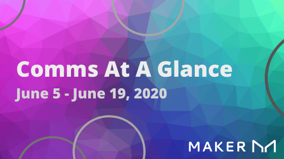

# June 5 - June 19, 2020

Hey Maker community, welcome to the first edition of Comms At A Glance. This is your one-stop-shop for updates on the MakerDAO ecosystem.

We value your input! Leave a reply, post in the forum, or join us in the CommDev channel on Maker Chat to let us know what you want to see.

## **Stakeholders**

**Maker \(MKR\) Holders + DAI Holders + Vault Owners**

### **State of the Peg**

[**https://daistats.com/\#/**](https://daistats.com/#/)

### **Major Governance Moves**

Governance at a glance

#### Issues

1. Why aren’t MKR Holders voting?

   1. [Forum Discussion](https://forum.makerdao.com/t/why-arent-mkr-holders-voting/301)

2. 
#### Proposals

1. Executive Vote: Raise the Base Rate

The Maker Foundation Interim Governance Facilitator has placed an Executive Vote into the voting system to raise the Base Rate from 0% to 1%.

* [Blog](https://blog.makerdao.com/executive-vote-june-12-2020/)
* Vote

## **Contributors**

### **Working groups updates** 

**Vault analysis team**

### **Collateral Statuses, MIPs update and current cycle point** 

* [**MIPS Forum**](https://forum.makerdao.com/c/MIPs/14)
  * [**Ideas**](https://forum.makerdao.com/c/MIPs/conception/20)
  * [**Proposals**](https://forum.makerdao.com/c/MIPs/proposal-ideas/21)
  * [**Requests for Comments \(RFCs\)**](https://forum.makerdao.com/c/MIPs/rfc/15)
  * [**Formal Submissions \(FS\)**](https://forum.makerdao.com/c/MIPs/fs/16)

### **Forum Posts to Review \(with tl;dr\)**

### **Rocket Chat Review**

## **Noobs**

### **Tweet of the week, Reddit post of the week** 

**N00b**  

[**https://twitter.com/stephendpalley/status/1119600502164135937**](https://twitter.com/stephendpalley/status/1119600502164135937)  
****

[**https://twitter.com/RuneKek/status/1270807465202978818**](https://twitter.com/RuneKek/status/1270807465202978818)  
****

[**Twitter**](https://twitter.com/search?q=makerdao&src=typed_query)

[**Reddit**](https://www.reddit.com/r/MakerDAO/)

### **Looking to learn more about MakerDAO?**

**Check out these excellent resources:**

* [**Introduction to the Maker Protocol**](https://docs.makerdao.com/)
* [**Awesome-MakerDAO \(AMD\)**](https://awesome.makerdao.com/') **is a community-driven resource people can use to familiarize themselves with Dai and MakerDAO.**

### **Community Projects and Contributing**

* CommDev

  * [Contributing](https://community-development.makerdao.com/contributing)
  * Weekly Call

* Governance
  * [Contributing](https://forum.makerdao.com/c/governance/gnr/8)
  * Weekly Call - Thursdays at 16:00 UTC

    * [Video/Voice](https://zoom.us/j/697074715)
    * [Dial-in](https://zoom.us/u/acRbIMDvK)
    * [Calendar](https://calendar.google.com/calendar/embed?src=makerdao.com_3efhm2ghipksegl009ktniomdk@group.calendar.google.com&ctz=America/Los_Angeles)
    * [Archives](https://community-development.makerdao.com/governance/governance-and-risk-meetings)
* Risk

  * Contributing
  * Weekly Call

* Legal
  * Contributing
  * Weekly Call

## **Feedback**

Feedback and room for improvement

Survey link

